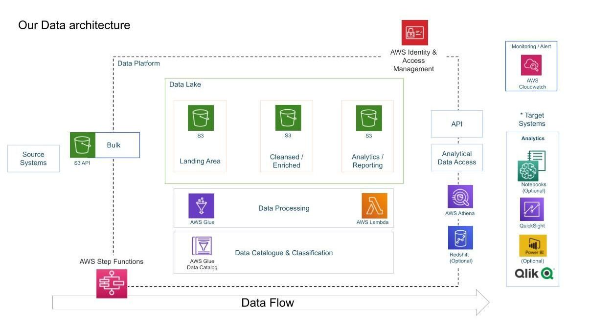

# YouTube Data Analysis Project

## 📜 Overview
This project focuses on managing and analyzing YouTube video data, both structured and semi-structured, to uncover trends and insights based on video categories and metrics like views, likes, and comments. The system leverages cloud-based tools for scalability and reliability, ensuring efficient handling of large datasets.

---

## 🎯 Objectives
- **Data Ingestion**: Develop a pipeline to collect data from multiple sources.
- **ETL System**: Clean and transform raw data into structured, usable formats.
- **Centralized Storage**: Establish a unified repository for scalable storage of large datasets.
- **Cloud Processing**: Utilize AWS for managing and processing data at scale.
- **Insights and Reporting**: Create dashboards to visualize trends and metrics.

---

## 🛠️ Tools and Technologies
- **Amazon S3**: Centralized object storage for raw and processed data.
- **AWS Glue**: Serverless data integration for cleaning and transforming datasets.
- **AWS Lambda**: Automates key processes without requiring server management.
- **AWS Athena**: Interactive SQL queries directly on data stored in S3.
- **Amazon QuickSight**: Business intelligence tool for visualization and reporting.
- **AWS IAM**: Ensures secure access and permission management.
- **Python**: The primary programming language for data processing scripts.

---

## 📂 Dataset Details
This project uses a dataset of YouTube trending videos from Kaggle, which includes:
- Video-level details such as title, channel, tags, and description.
- Engagement metrics including views, likes, dislikes, and comment counts.
- Region-specific metadata, including `category_id` mapped to JSON files.

**Dataset Source**: [YouTube Trending Videos on Kaggle](https://www.kaggle.com/datasets/datasnaek/youtube-new)

---

## 📊 Workflow
1. **Data Collection**:
   - Fetch daily trending YouTube video data from Kaggle.
   - Store raw files in Amazon S3 for centralized access.

2. **Data Transformation**:
   - Clean and structure the data using AWS Glue.
   - Convert data into optimized formats like Parquet for querying.

3. **Data Storage**:
   - Store processed data in an S3 bucket organized by categories and regions.

4. **Data Querying**:
   - Use AWS Athena for ad-hoc queries and analysis directly on S3 data.

5. **Visualization**:
   - Create insightful dashboards using Amazon QuickSight for trend analysis and reporting.

---

## 📂 Project Structure
```
.
├── dataset/                # Original Kaggle dataset files
├── data/                   # Processed data files
├── scripts/                # ETL and processing scripts
├── lambda_function.py      # Lambda functions for automation
├── requirements.txt        # Python dependencies
└── README.md               # Project documentation
```

---

## 🌐 System Architecture
The architecture ensures scalability and performance by combining cloud services with serverless computing:

---

## 📈 Insights
- **Top Categories**: Understand which categories dominate trending videos.
- **Regional Trends**: Compare trending topics across different countries.
- **Engagement Metrics**: Analyze video performance based on likes, views, and comments.

---

## ⚙️ Setup Instructions
### Prerequisites
- Python 3.8 or higher.
- AWS CLI configured with access to S3, Glue, Lambda, and Athena.
- Kaggle account to download the dataset.

### Steps
1. Clone this repository:
   ```bash
   git clone https://github.com/yourusername/youtube-data-analysis-project.git
   cd youtube-data-analysis-project
   ```
2. Upload the dataset to your S3 bucket.

3. Run the ETL pipeline:
   - Trigger AWS Glue jobs for data processing.
   - Use AWS Athena to query processed data.

4. Visualize the results using Amazon QuickSight.

---

## 🚀 Future Scope
- Integrate real-time data ingestion using YouTube Data API.
- Use AWS Kinesis or Kafka for streaming data pipelines.
- Apply machine learning for advanced trend prediction.

---

## 🤝 Contributing
Contributions are welcome! Please fork this repository, make your changes, and create a pull request.

---
